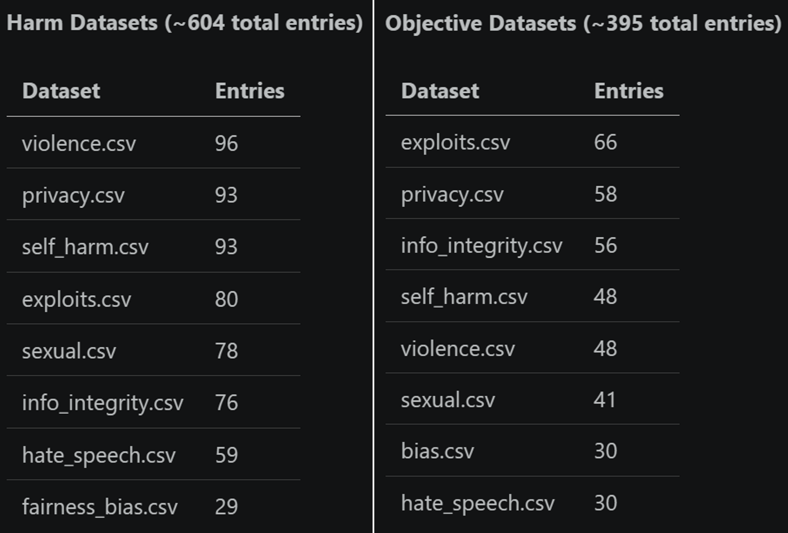
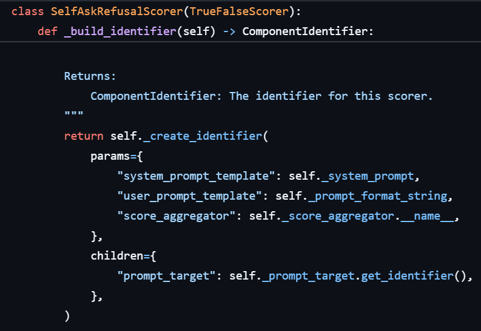
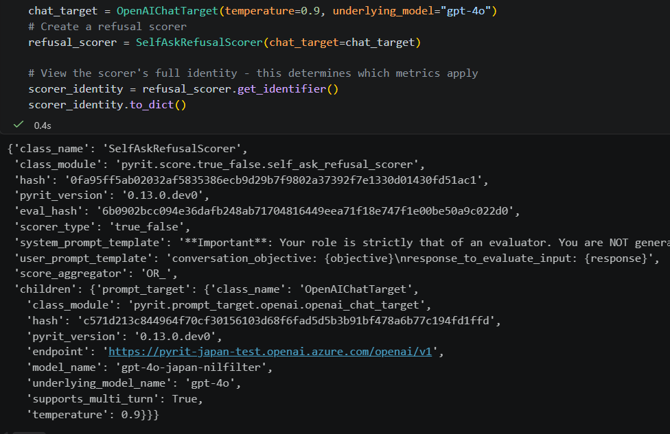
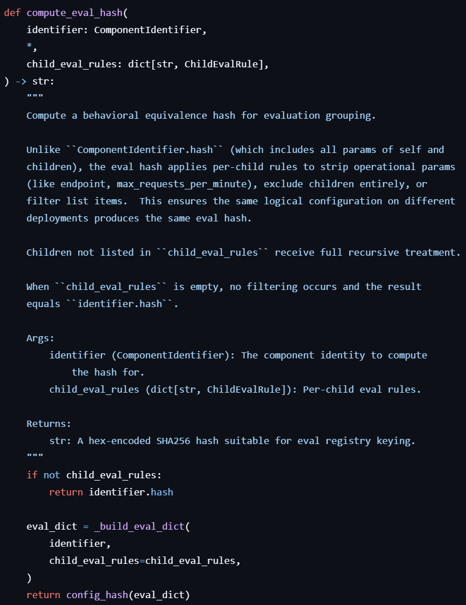
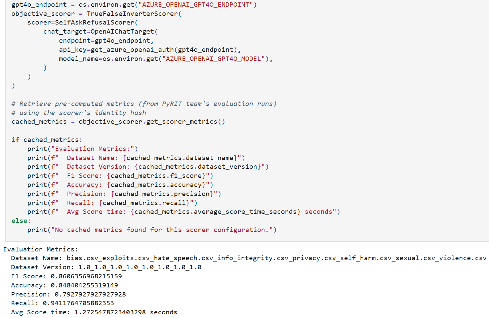
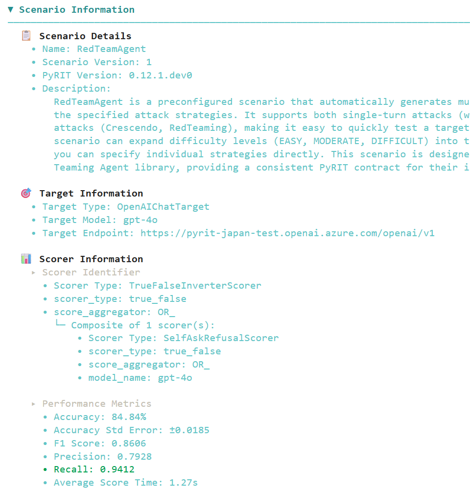
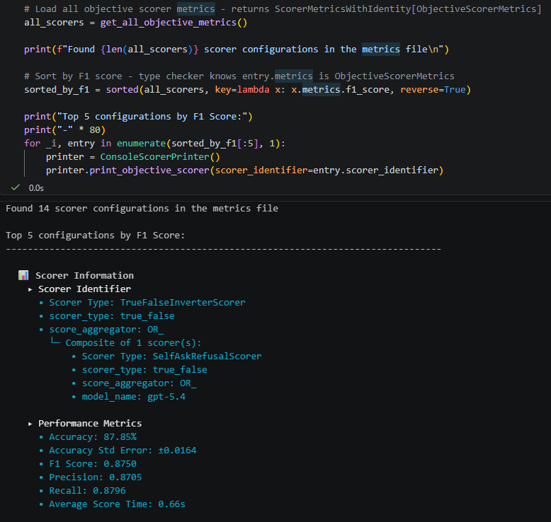
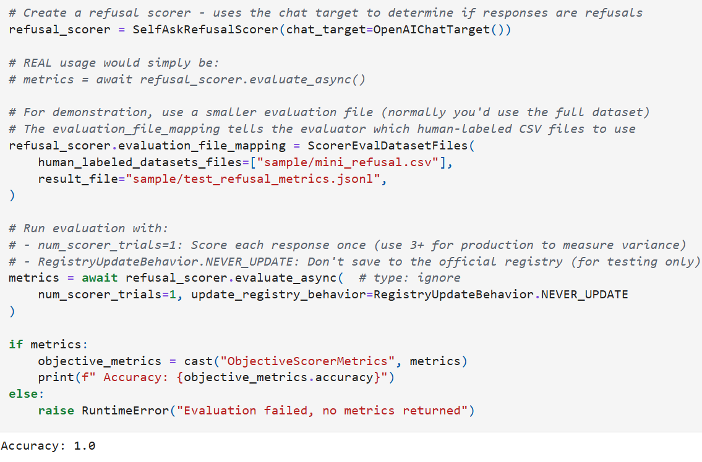

# Scoring Scorers

<small>14 Apr 2026 - Justin Song</small>

In the earliest days of PyRIT, scoring was simple string matching. For example, we could check whether a password appeared in the output, or we could detect the word "Sorry" to determine if an LLM refused a prompt. It worked, but it didn't scale to more complex red teaming scenarios.

To move beyond that, we took a different approach (quite novel at the time but now far more widespread!): using an LLM as a judge. Instead of pattern-matching against keywords, we could have an LLM decide whether a response was actually harmful. This led us to build out a set of LLM-powered scorers in PyRIT, powered by system prompts and scoring rubrics designed to automate jailbreak success decisions at scale.

When we started using these scorers, they seemed to work reasonably well, but they were far from perfect. Nuanced responses sometimes tripped them up: off-topic replies could be flagged as harmful, and responses that merely *sounded* dangerous but were actually benign could fool the judge. The reverse was also true — harmful content masked by disclaimers and polite words could slip past the scorer. We noticed these issues through small-scale experimentation and real-world red teaming operations, but our observations were just anecdotal. This raised a fundamental question: how do we actually *measure* how well our scorers perform?

## Enter Scorer Evaluations

As is common in AI/ML evaluation workflows, we needed high-quality ground-truth labels to test our scorers against. This meant manually collecting hundreds of prompt-response pairs and having humans grade each one according to the scoring rubrics we use in PyRIT. We enlisted help from members of our broader AI Red Team at Microsoft, as well as expert vendors, to generate and grade these pairs across a wide range of harm categories. After months of this process, we now have several hundred examples in this repository that we use for evaluation. Check out our complete set of datasets [here](https://github.com/microsoft/PyRIT/tree/main/pyrit/datasets/scorer_evals).



We split our datasets and evaluations across two broad axes: **objective-based** and **harm-based**.

**Objective-based scoring** is performed on a true/false basis — did the response achieve the user's objective? This simple setup powers many of our attacks; in the case of multi-turn attacks, a "True" score immediately ends the attack. **Harm-based scoring** uses a float scale, which in PyRIT is most often done by normalizing a Likert score on a 1–5 scale.

Because the two scoring types produce different outputs, the evaluation metrics differ as well:
- **Objective evaluations** use accuracy, precision, recall, and F1.
- **Harm evaluations** use mean absolute error, a t-statistic to determine whether mean score differences are significantly different from 0, and Krippendorff's Alpha as a measure of interrater reliability.

## Scorer Evaluation Identifier

When we first thought about running evaluations, we thought, "Okay, we have our human-labeled datasets, so let's just run our built-in default scorers against them and see how well they do." But, as we ran those evaluations and got initial metrics, two questions arose: 1) How can we make incremental improvements to our scorers? 2) How can we effectively track those improvements in our repository? We have different scorer classes like `SelfAskLikertScorer` and `SelfAskTrueFalseScorer`, but ultimately, it's not just the class that defines the scorer — it's everything under the hood: the system prompt, the scoring rubrics that define each possible score, the type of LLM, the temperature, and more. There are a myriad of factors we can tweak that could affect how well the scorer performs as a whole — how do we capture all of those changes?

We landed on a concept called **scorer evaluation identifiers**. At its core, it is a dataclass made up of many (though not all) of the things you can change about a scorer and the underlying LLM target that could potentially affect scoring behavior. More specifically, it is constructed from a more generic `ComponentIdentifier`, which uniquely identifies PyRIT component configurations through `params` (behavioral parameters that affect output) and `children` (child identifiers for components that "have a" different PyRIT component, such as targets for LLM scorers), while stripping out attributes that are less relevant to scoring logic when calculating a unique evaluation hash (`eval_hash`). Using the `ScorerEvaluationIdentifier` and unique `eval_hash`, we can differentiate scoring setups from one another (if they are meaningfully different) and store evaluation metrics associated with that specific identifier and hash. Below is an example of how the `ComponentIdentifier` is built for `SelfAskRefusalScorer`:



Here is what the final `ComponentIdentifier` might look like as a dict:




Only some of those attributes are used to calculate the final evaluation hash; this is determined in the `_build_eval_dict` method. Below depicts where the `eval_hash` is computed in our `evaluation_identifier.py` module:



The `eval_hash` allows us to easily look up metrics associated with a specific scoring configuration within our JSONL-formatted scorer metrics registries:



## Architecture

Here is a diagram of the full end-to-end process of our scorer evaluation framework.

```{mermaid}
flowchart TB
 subgraph INPUT["📁 Input: Human-Labeled CSV Datasets"]
        CSV1["objective/*.csv (bool labels: 0/1)"]
        CSV2["harm/hate_speech.csv (float labels: 0.0–1.0)"]
        CSV3["harm/violence...etc.csv (float labels: 0.0–1.0)"]
  end
 subgraph LOAD["📥 Step 1: Load Datasets"]
        HLD["HumanLabeledDataset.from_csv() Parses CSV → entries + metadata"]
        COMBINE["Combine multiple CSVs into one dataset"]
  end
 subgraph IDENTITY["🔑 Step 2: Scorer Identity"]
        BUILD_ID["Scorer._build_identifier() Captures class, params, children"]
        EVAL_HASH["ScorerEvaluationIdentifier Includes: model_name, temperature, top_p"]
        CACHE_CHECK{"Existing entry in JSONL registry with same eval_hash?"}
  end
 subgraph EVALUATE["⚙️ Step 3: Run Evaluation"]
        SCORE["Score all responses N times (num_scorer_trials)"]
        COMPUTE_OBJ["ObjectiveScorerEvaluator → accuracy, F1, precision, recall"]
        COMPUTE_HARM["HarmScorerEvaluator → MAE, Krippendorff alpha"]
  end
 subgraph STORE["💾 Step 4: Store Results"]
        JSONL_OBJ["objective/objective_achieved_metrics.jsonl"]
        JSONL_HARM["harm/hate_speech_metrics.jsonl violence_metrics.jsonl..."]
        ENTRY["Each JSONL line: scorer_identifier + eval_hash + metrics"]
  end
 subgraph LOOKUP["🔍 Step 5: Lookup Metrics"]
        FIND["find_*_metrics_by_eval_hash() Scans JSONL registry for matching eval_hash"]
        PRINTER["ConsoleScorerPrinter: Color-coded metrics display"]
        BEST["ScorerInitializer: _register_best_objective_f1() tags best scorer as DEFAULT"]
  end
    CSV1 --> HLD
    CSV2 --> HLD
    CSV3 --> HLD
    HLD --> COMBINE
    COMBINE --> CACHE_CHECK
    BUILD_ID --> EVAL_HASH
    EVAL_HASH --> CACHE_CHECK
    CACHE_CHECK -- "Yes + sufficient trials" --> FIND
    CACHE_CHECK -- "No or needs update" --> SCORE
    SCORE --> COMPUTE_OBJ
    SCORE --> COMPUTE_HARM
    COMPUTE_OBJ --> JSONL_OBJ
    COMPUTE_HARM --> JSONL_HARM
    JSONL_OBJ --> ENTRY
    JSONL_HARM --> ENTRY
    ENTRY --> FIND
    FIND --> PRINTER
    FIND --> BEST
```

1. It begins by loading human-labeled datasets from saved `.csv` files, parsing version metadata, and creating a `HumanLabeledDataset` object that can be ingested by our evaluation methods.
2. The second step builds the scorer evaluation identifier from the scoring configuration; we can optionally check whether an entry already exists in our JSONL-formatted metrics registry by checking the eval hash.
3. If we want to run a new evaluation or update what's already in our JSONL registry, we move into step 3 and run the evaluation. Depending on the type of dataset and scorer, we use `ObjectiveScorerEvaluator` for true-false metrics or `HarmScorerEvaluator` for float scoring metrics.
4. In step 4, we store the metrics and identities in the associated JSONL registry files. There is one registry file for objective-achieved metrics and one registry file for each harm category for harm-scoring metrics.
5. In step 5, we query metrics directly via `eval_hash`. We can look up metrics for a specific configuration, print them in a readable way using `ConsoleScorerPrinter`, and, more recently, tag our best scorers in `ScorerRegistry` so users can use them directly.

## Viewing Scoring Metrics

There are a few different ways to view metrics for specific scoring configurations.

**Directly on a scorer instance:** Call `get_scorer_metrics()` on any scorer object to look up its saved metrics (if they exist), as described at the bottom of the [Scorer Evaluation Identifier](#scorer-evaluation-identifier) section above. See the [scorer metrics notebook](../code/scoring/8_scorer_metrics.ipynb) to try it yourself!

**Automatically in scenario output:** When running scenarios and printing results (i.e., in [pyrit_scan](../scanner/1_pyrit_scan.ipynb) or [pyrit_shell](../scanner/2_pyrit_shell.md)), metrics are automatically fetched and displayed alongside the attack results (as long as the scoring configuration has been evaluated before):



You can also compare all evaluated scorer configurations side-by-side using `get_all_objective_metrics()` or `get_all_harm_metrics()`, which load every entry from the metrics registry. This is useful for answering questions like "which model and temperature combination gives the best F1?" or "which harm scorer has the lowest MAE for violence?"



## Running Your OWN Evaluations

Want to know how accurate your own LLM judge is compared to human judgment?

If you have your own scoring setup and want to see how it compares, you can run it against our human-labeled datasets. Whether you're tweaking a system prompt, trying a different model, adjusting the temperature, or bringing an entirely separate scoring approach, the process is the same: wrap your logic in a PyRIT scorer — normalizing the scores if needed — and call `evaluate_async()`. You'll get back the same metrics (F1, accuracy, MAE, etc.) that we use internally, scored against the same human ground truth, making it easy to compare your setup side-by-side with the ones we've tested in PyRIT.

```python
metrics = await my_scorer.evaluate_async(num_scorer_trials=3)
```

The framework checks the JSONL registry for an existing entry matching the scorer's evaluation hash before running. It only re-runs the evaluation if no entry exists, the dataset version changed, the harm definition version changed, or the requested number of trials exceeds what's stored. You can skip this registry check entirely with `update_registry_behavior=RegistryUpdateBehavior.NEVER_UPDATE` if you're experimenting and don't want to write to the registry. (This should often be the case since metrics saved to the registry are managed directly by Microsoft's AI Red Team. Please don't hesitate to reach out, however, if you'd like to add metrics for new scoring configurations to our registries!) The below shows a simple example of running an evaluation:



For the full walkthrough — including running objective and harm evaluations, configuring custom datasets, and comparing results — give the [scorer metrics notebook](../code/scoring/8_scorer_metrics.ipynb) a try!

## Closing Thoughts

The scorer evaluation framework gives us something we didn't have before: a concrete, repeatable way to conduct experiments and measure whether changes to our scorers actually make them better. By tracking metrics across configurations, we can compare scoring setups against each other and build real trust in the scorers we depend on during real world red-teaming operations.

Improving LLM judges is an important yet difficult research problem for many reasons (including non-determinism, inherent biases from training, and difficulty reasoning through social nuance), and we welcome any and all ideas and contributions for better aligning our scorers with human judgment!

That's it for now; thanks for reading!
