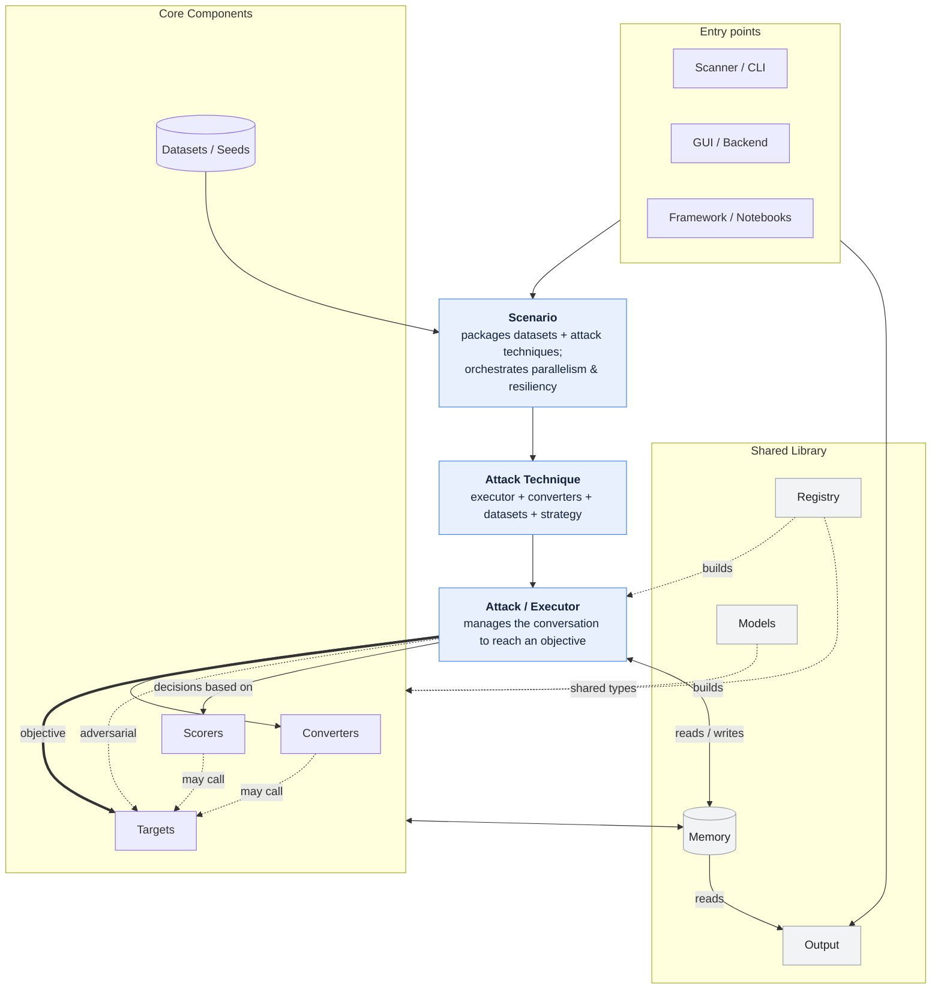
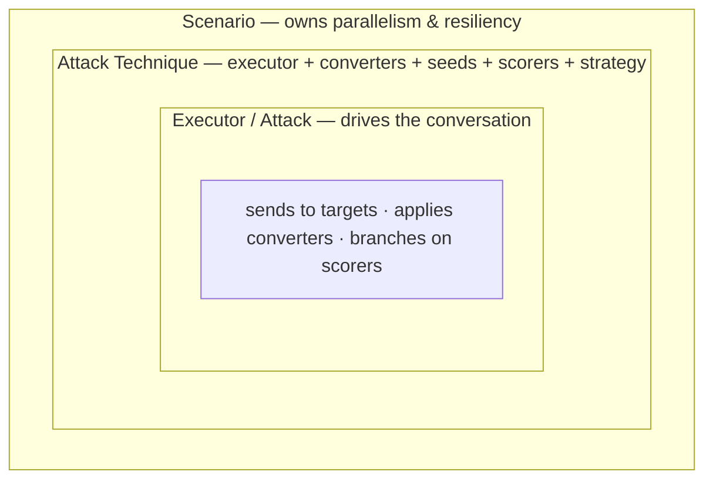

# Framework

Learn how to use PyRIT's components to build red teaming workflows.

:::::{grid} 1 1 2 3
:gutter: 3

::::{card} 📦 Datasets
:link: ./datasets/0_dataset
Load, create, and manage seed datasets for red teaming campaigns.
::::

::::{card} 📋 Scenarios
:link: ./scenarios/0_scenarios
Run standardized evaluation scenarios at scale across harm categories.
::::

::::{card} 🧩 Attack Techniques
:link: ./scenarios/0_attack_techniques
Package an executor, converters, datasets, and strategy into a single named attack.
::::

::::{card} ⚔️ Executors and Attacks
:link: ./executor/0_executor
Run single-turn and multi-turn attacks — Crescendo, TAP, Skeleton Key, and more.
::::

::::{card} 🔄 Converters
:link: ./converters/0_converters
Transform prompts with text, audio, image, and video converters.
::::

::::{card} 🔌 Targets
:link: ./targets/0_prompt_targets
Connect to OpenAI, Azure, Anthropic, HuggingFace, HTTP endpoints, and custom targets.
::::

::::{card} 📊 Scorers
:link: ./scoring/0_scoring
Evaluate AI responses with true/false, Likert, classification, and custom scorers.
::::

:::::

---

The sections above link to detailed guides for each component. The architecture below explains how the pieces fit together — it's primarily aimed at contributors.

# Architecture

The main components of PyRIT are seeds, scenarios, attack techniques, executors and attacks, converters, targets, and scorers. The best way to contribute to PyRIT is by contributing to one of these components.

The diagram below shows how the pieces fit together: entry points run **scenarios**, which package **datasets** with **attack techniques**; each technique drives an **attack/executor** that orchestrates **converters**, **targets**, and **scorers**; and a shared library layer (**memory**, **registry**, **models**, **output**, and more) supports all of them.

The orchestration layers **nest from broadest to narrowest** — each owns less than the layer above it:

- **Scenario** packages many attack techniques and owns parallelism and resiliency.
- **Attack Technique** configures one executor with its converters, seeds, scorers, and strategy.
- **Executor / Attack** runs the algorithm: sends to targets, applies converters, and branches on scorers.

# Core Components

As much as possible, each core component is a pluggable brick of functionality. Prompts from one attack can be used in another. An attack for one scenario can use multiple targets. And sometimes you completely skip components (e.g. almost every component can be a NoOp also, you can have a NoOp converter that doesn't convert, or a NoOp target that just prints the prompts).

If you are contributing to PyRIT, that work will most likely land in one of the core components buckets and be as self-contained as possible. It isn't always this clean, but when an attack scenario doesn't quite fit (and that's okay!) it's good to brainstorm with the maintainers about how we can modify our architecture. Also, please open issues if you see anything under Framework Plans you do/don't want.

## [Datasets](./datasets/0_dataset)

**Responsibility**: Create a single place to manage seeds

- New Datasets can be added in the dataset module.
- Datasets should never be retrieved from SeedDatasetProviders; SeedDatasetProviders should load into memory, and then components retrieve from memory
- Most components should always work with seeds passed directly in (except scenarios which may package them from memory). Never use SeedDatasetProviders, file paths, etc. Either pass the seed as an argument or retrieve from memory.
- There is a Seed hierarchy and the right types should be used (SeedObjective, SeedPrompt, SimulatedSeedPrompt, AttackSeedGroup, ...)
- **Does not own**: a dataset defines and holds seeds; it doesn't package them for an attack. Specifically not:
  - selecting or combining which seeds an attack uses (that's a scenario / attack technique)
  - rendering or parameterizing prompts at send time (converters / normalizers)
  - runtime retrieval from providers or filepaths (load into memory first)

**Framework Plans**:

- There is some churn here. We haven't managed these much at scale, and we may have to redefine how it works.
- We want more investment in managing datasets and loading them more intelligently
- We need to more consistently pass seeds/use memory (e.g. not using filepaths)
- We need to create seed types for different executors (e.g. SeedExpectedResponse, SeedBenchmarkGroup)

**Contributing (difficulty easy)**: Are there more prompts and jailbreak templates you can add that include scenarios you're testing for? It is easy to add new dataset providers.

## [Scenarios](./scenarios/0_scenarios)

**Responsibility**: This is the avenue to "run PyRIT against something". What does that look like?

- A scenario takes user input and uses it to package datasets with attack techniques
- A scenario orchestrates resiliency and parallelism from a high level
- No result should depend on previous results (that is an attack's job)
- **Does not own**: the per-objective conversation logic. Branching, turn-by-turn adaptation, and scoring-based decisions belong to the attack; a scenario selects and packages existing attack techniques rather than defining new attack algorithms or datasets.

**Framework Plans**:

- Scenarios are new enough that we are still discovering patterns and limitations. So they will regularly be refactored

**Contributing (difficulty medium)**: Is there a scanner that does something PyRIT doesn't? Add it as a scenario. But because we're changing how things are done rapidly, it is not as well-defined as other areas.

## [Attack Techniques](./scenarios/0_attack_techniques)

**Responsibility**: An attack technique packages an executor, converters, datasets, and strategies into a single named attack. The goal is that any attack (something trying to achieve an objective) can be defined as an attack technique.

- Techniques are self-describing `AttackTechniqueFactory` instances (a `name`, `attack_class`, `attack_kwargs`, and `technique_tags`). They read like configuration even though they are code, so adding one — or bringing your own — is easy. The canonical catalog lives under `pyrit/setup/initializers/techniques/`: `core.py` (a small, curated standard set, auto-loaded on a bare `initialize_pyrit_async`), `extra.py` (the broader collection, opt-in), and per-source modules like `airt.py` (owned by a source/scenario but reusable, tagged with their owner and kept out of the default pool).
- `core` stays deliberately small so a default run doesn't print 200 techniques or take forever; the wider catalog lives in `extra` and is selected on demand. Users pick subsets by passing initializer tags (e.g. `core`, `extra`, `all`) or writing their own initializer, so different runs — including from the CLI — can register different technique sets without changing the catalog.
- A technique tied to one scenario is fine; if it's pinned and non-reusable it can stay local to that scenario, but if another scenario could reuse it, promote it to a catalog module and tag it.
- Tags describe a technique (behavioral tags like `single_turn`/`multi_turn`, owner tags like `airt`); they don't decide what a scenario runs. There is deliberately **no global `default` tag** — a default is scenario-relative, declared per scenario via `build_technique_class_from_factories` (the `factories` list is the pool, catalog tags become named aggregate presets, and `default_tags` / `default_names` set what runs when nothing is chosen).
- **Does not own**: the conversation algorithm itself. Branching, turn management, and scoring decisions live in the executor it wraps — a technique only selects and configures existing components, and shouldn't implement new sending, scoring, or branching logic.

**Framework Plans**:

- Growing `extra` toward hundreds of techniques while keeping `core` small and curated, and making it easier to select technique subsets (via tags, initializers, or the CLI) without slow, noisy default runs.

**Contributing (difficulty easy)**: Add an `AttackTechniqueFactory` to `extra.py` (the default home for new general-purpose techniques), or to a source-owned module (like `airt.py`) if it belongs to a specific scenario but could be reused. `core` is reserved for the curated standard set. Tag it with its behavioral tags; don't tag it `default`.

## [Executors and Attacks](./executor/0_executor)

**Executor Responsibility**: Manage conversations between objective targets and adversarial targets; using datasets, scorers, and converters.

**Attack Responsibility**: An attack is a type of executor, which manages conversations to achieve an objective.

- Any branching decision (e.g. the next thing(s) to do is based on a previous result) should be an attack/executor.
- Executors should always make use of other component's responsibilities. An executor should always branch based on a scorer and NOT a direct response. (e.g. was this prompt blocked? is a scorer responsibility, not an executor responsibility)
- Executors should use scoring and target capabilities implicitly. Executors should support multi-modal.
- Compound attacks are possible, combining different attacks in different ways.
- **Does not own**: packaging the attack. Those are passed in as configuration by the **attack technique**, not assembled here:
  - prepended / system prompts, role-play framing, the converter stack, or dataset selection (e.g. if an executor assembles its own prompt scaffolding for a simulated conversation, that is attack-technique work bleeding into the executor)
  - branching on raw responses (use a scorer), constructing its own components (use the registry), or formatting / persisting results (output / memory)

**Framework Plans**:

- We need to move some older attacks that don't belong here. Many should just be attack techniques
- There are potential ways we could combine different algorithms. Are Crescendo and TAP ultimately the same?
- We need to support target capabilities more implicitly
- Other executors, like benchmarks, need better end-to-end support; potentially including an `ExpectedResult` seed and associated scorers.
- More flexible compound attacks should continue to be added

**Contributing (difficulty high)**: The best way to contribute is likely opening issues if you run into limitations.

## [Converters](./converters/0_converters)

**Responsibility**: Converters are a component that converts prompts to something else. They can be stacked and combined. They can be as varied as translating a text prompt into a Word document, rephrasing a prompt, or adding a text overlay to an image.

- **Does not own**: conversation state or attack decisions. A converter transforms input into output (and may call a target to do so), but it doesn't branch on results, score, persist to memory itself (the normalizer handles persistence), or decide when it runs — the attack/technique configures the stack.

**Framework Plans**:

- We want to refactor our converter pipeline, so there are currently some things that should be converters that we may want to postpone (e.g. partial converting). This is supported but could be much more dynamic.

**Contributing (difficulty low)**: The existing pattern is well-defined. Are there ways prompts can be converted that would be useful for an attack?

## [Targets](./targets/0_prompt_targets)

**Responsibility**: A target can be thought of as "the thing we're sending the prompt to". Many other components use it, including scorers, attacks, and converters.

- This is often an LLM, but it doesn't have to be. For Cross-Domain Prompt Injection Attacks, the target might be a storage account that a later target has a reference to. Message and conversation should be generic enough to handle this extra data.
- Target capabilities should be used to see if a target is compatible with the capabilities that the other components want to use.
- Targets should use message_normalizer along with TargetConfiguration to transform `Messages` into formats that target supports.
- Because targets are so varied, it is reasonable to return multiple tool calls, or none at all.
- One attack can have many targets (and in fact, converters and scorers can also use targets to convert/score the prompt).
- **Does not own**: what to send or what to do with the response. A target sends a prepared `Message` and returns a response — it doesn't convert prompts (converters), score (scorers), manage the conversation or decide the next turn (attacks), apply attack logic, or persist prompts and responses to memory (the `prompt_normalizer` owns that). Its retries stay at the target layer (e.g. `RateLimitException`).

**Framework Plans**:

- Better agent support may require extra pieces attached to a Message
- Better surface support may require expanding the return types

**Contributing (difficulty low)**:

- The pattern is well-defined.
- Are there models you want to use at any stage or for different attacks? But also, can your model just be one of the existing targets?

## [Scorers](./scoring/0_scoring)

**Responsibility**: Scorers give feedback to the attack on what happened with the prompt. This could be as simple as "Was this prompt blocked?" or "Was our objective achieved?"

- Any decision an attack makes should be based on a scorer result
- A scorer is not limited to a prompt, it could be anything (e.g. was this tool called or was this file written).
- **Does not own**: acting on its own result. A scorer evaluates a response and returns a score; branching on that score is the attack's job, and aggregating scores across runs is analytics'. It may call a target to evaluate, but it doesn't send the attack's objective prompt or manage the conversation.

**Framework Plans**:

- Scorers will be refactored to be more generic, so they can determine more general results (does a file exist? Was a tool called?)

**Contributing (difficulty low)**:

- The pattern is well-defined.
- You can evaluate how accurate probabilistic scorers are and likely make them more accurate.
- Is there data you want to use to make decisions or analyze?

# Shared Library

The below talks about responsibilities of most modules in the PyRIT library

## Analytics

**Responsibility**: Make sense of results — aggregating across conversations and attacks to answer questions PyRIT itself acts on or reports.

- This is where cross-run analysis belongs: e.g. "which attack performed best for this objective?", "how often did a technique succeed?", or "which responses match known content?".
- **Does not own**: live, in-attack decisions — any decision made *during* an attack is a scorer's job. Analytics only operates on stored results, after the fact.
- Today it includes `ConversationAnalytics` (inspecting conversation history), `analyze_results` / `AttackStats` (aggregating outcomes across techniques), and text-matching strategies (`ExactTextMatching`, `ApproximateTextMatching`).

## Auth

**Responsibility**: Provide authentication helpers for the external services PyRIT talks to, behind a common `Authenticator` abstraction.

- Components that need credentials should go through these helpers rather than handling tokens themselves.

## [Exceptions](../contributing/9_exception)

**Responsibility**: Define PyRIT's exception hierarchy and the retry behavior built around it.

- Retries should use PyRIT exception types (such as `PyritException`, `BadRequestException`, `RateLimitException`, `EmptyResponseException`, and `InvalidJsonException`) and retry decorators (such as `pyrit_target_retry`, `pyrit_json_retry`, `pyrit_placeholder_retry`) and execution-context utilities (`ExecutionContext`, `ComponentRole`, `RetryCollector`).
- Retries should _only_ be attempted on known exceptions.
- The applicable layer should retry exceptions (e.g. only targets should retry `RateLimitException`, only scorers/attacks/converters should retry `InvalidJsonException`, and only scenarios should retry general exceptions).
- When raising, attach context: every `PyritException` carries a `status_code` and a human-readable `message`, and the active `ExecutionContext` / `ComponentRole` records which component raised it — so failures point back to where they happened.

## [Memory](./memory/0_memory)

**Responsibility**: Memory persists and retrieves the data that flows between components — prompts, responses, conversations, scores, and attack results — so components stay swappable while still sharing the context they need.

- One important thing to remember about this architecture is its swappable nature. Seeds, targets, converters, attacks, and scorers should all be swappable. But sometimes one of these components needs additional information. If the target is an LLM, we need a way to look up previous messages sent to that session so we can properly construct the new message. If the target is a blob store, we need to know the URL to use for a future attack.
- Components should access memory through `CentralMemory` rather than passing state directly between each other.
- Memory backends are swappable too (e.g. SQLite or Azure SQL) without changing the components that use them.
- **Does not own**: business logic or decisions. Memory stores and retrieves state; it doesn't decide what to send, how to score, or when to branch — components do that and persist results here.

## [Models](../contributing/11_memory_models)

**Responsibility**: pyrit.models is a lightweight module where core types are defined. These should always be used where possible to prevent drift.

- If you are creating a class that has a lot of overlap with another class, or using a dict to serialize across boundaries, consider if you can use/move pyrit.models
- Models includes `identifiers` which are descriptions of the core components. And along with the registry, can often recreate those components.
- Models includes types passed around between components, and should be prefered in REST
- models should never depend on anything except lightweight Python (the standard library and pydantic) and pyrit.common

## [Normalizers](./targets/11_message_normalizer)

**Responsibility**: Reshape prompts and conversations so components and targets can interoperate. There are two distinct modules:

- **`prompt_normalizer`** applies converters and dispatches individual prompts to a `PromptTarget` (handling batching and memory persistence). It is the single component that writes each request and response to memory; targets never persist on their own. `NormalizerRequest` and `ConverterConfiguration` describe what to send and which converters to apply.
- **`message_normalizer`** reshapes multi-message conversation payloads into the structure a given model expects — for example, handling system-message behavior (keep / squash / ignore), history squashing, and tokenizer chat templates.

## [Output](./output/0_output)

**Responsibility**: The Output module is responsible for writing different components in different formats to different places.

- It renders the core result types — attack results, scenario results, conversations, and scores — without those components needing to know how they are displayed.
- Format and destination are decoupled: a **format** (e.g. pretty ANSI, Markdown, JSON) is separate from a **sink** (stdout, file, Jupyter), so any result can be rendered any way to anywhere.
- **Does not own**: deciding *what* to render or *when*. Components hand results to output; format classes only turn data into strings and never fetch data, touch `CentralMemory`, or call `print()` directly (that's isolated to leaf printer classes).

**Contributing (difficulty low)**: Adding a new format or sink is well-defined. Every new domain printer should come with a matching convenience function in `helpers.py`.

## [Registry](./registry/0_registry)

**Responsibility**: The registry is used to build and store the core components.

- If you are creating a component with user input (e.g. via config, REST, or automatically) it should always use the registry
- If you are storing an instance of a component, it should always use the registry

## [Setup](./setup/0_setup)

**Responsibility**: Bootstrap a PyRIT session — getting memory, defaults, and components configured so the rest of the framework can run.

- `initialize_pyrit_async` is the entry point: it sets up the environment and a memory backend (`IN_MEMORY` / `SQLITE` / `AZURE_SQL` via `MemoryDatabaseType`) and runs any initializers to configure global defaults and components.
- Configuration files are the core way to drive setup. `ConfigurationLoader` / `initialize_from_config_async` read a config that declares the memory backend and a list of initializers to run, so a session can be reproduced without code.
- By default these files live under the PyRIT home directory `~/.pyrit/`: the config file at `~/.pyrit/.pyrit_conf`, and environment variables from `~/.pyrit/.env` and `~/.pyrit/.env.local` (loaded if present).
- A `PyRITInitializer` is a class-based unit of configuration: each one configures part of PyRIT (e.g. registering targets, scorers, scenario techniques, or loading default datasets) and runs in the order provided. Built-in initializers live in the `initializers/` package.
- Users can bring their own: subclass `PyRITInitializer`, implement `initialize_async`, and reference it from config or pass it in — letting teams package their own defaults and components.

# Application surfaces

The below describes the user-facing surfaces built on top of the framework.

## Backend

**Responsibility**: Expose PyRIT functionality as a FastAPI REST API consumed by the CLI and frontend.

- Surfaces targets, scenarios, and health/version endpoints; served via `uvicorn` with Swagger/ReDoc docs.
- Wherever possible it should reuse other components rather than reimplementing them (e.g. the registry to build components, `pyrit.models` for its model layer), while adding presentation-specific information on top as needed.
- Organized into `routes/`, `services/`, `models/`, `mappers/`, and `middleware/`, and launched through the `pyrit_backend` command (configurable via `PYRIT_API_HOST` / `PYRIT_API_PORT` / `PYRIT_API_RELOAD`).

## [CLI](../scanner/0_scanner)

**Responsibility**: Offer command-line entry points into PyRIT as a thin REST client over the backend, deliberately avoiding heavy `pyrit` imports.

- Because it talks to the backend over HTTP, the CLI stays lightweight and starts quickly.
- It should not rely on pyrit other than pyrit.models, pyrit.common, and pyrit.output.

## [Documentation](../contributing/7_notebooks)

**Responsibility**: Show how PyRIT is used, concisely and runnably, across all the ways someone might pick it up.

PyRIT can be used in three modes ([Scanner](../scanner/0_scanner), [GUI](../gui/0_gui), and [Framework](#core-components)), and the documentation is organized to match:

- Notebooks that contain code should be notebooks that can execute.
- Notebooks should execute quickly (within a couple minutes).
- The percent-format `.py` files and their paired `.ipynb` notebooks must be kept in sync.

## [Frontend](../gui/0_gui)

**Responsibility**: Provide CoPyRIT, the graphical interface for human-led red teaming, by talking to the backend REST API.

- A TypeScript + React single-page app built with Vite and Fluent UI.
- Dev workflow via `dev.py` / npm scripts orchestrates both servers together; tested with Jest (unit) and Playwright (e2e).
