# Scoring

Scoring is a main component of the PyRIT architecture. It is primarily used to evaluate what happens to a prompt. It can be used to help answer questions like:

- Was prompt injection detected?
- Was the prompt blocked? Why?
- Was there any harmful content in the response? What was it? How bad was it?

This collection of notebooks shows how to use scorers directly. To see how to use these based on previous requests, see [the batch scorer](../scoring/6_batch_scorer.ipynb). Scorers can also often be [used automatically](../executor/attack/1_prompt_sending_attack.ipynb) as you send prompts.

There are two general types of scorers. `true_false` and `float_scale` (these can often be converted to one type or another). A `true_false` scorer scores something as true or false, and can be used in attacks for things like success criteria. `float_scale` scorers normalize a score between 0 and 1 to try and quantify a level of something (e.g. harmful content).

The scorer hierarchy is rooted at the abstract `Scorer` class. All concrete scorers derive from one of three intermediate base classes: `FloatScaleScorer`, `TrueFalseScorer`, or `ConversationScorer`.

```mermaid
classDiagram
    class Scorer { <<abstract>> }
    class FloatScaleScorer { <<abstract>> }
    class TrueFalseScorer { <<abstract>> }
    class ConversationScorer { <<abstract>> }

    Scorer <|-- FloatScaleScorer
    Scorer <|-- TrueFalseScorer
    Scorer <|-- ConversationScorer

    FloatScaleScorer <|-- AzureContentFilterScorer
    FloatScaleScorer <|-- AudioFloatScaleScorer
    FloatScaleScorer <|-- InsecureCodeScorer
    FloatScaleScorer <|-- PlagiarismScorer
    FloatScaleScorer <|-- SelfAskGeneralFloatScaleScorer
    FloatScaleScorer <|-- SelfAskLikertScorer
    FloatScaleScorer <|-- SelfAskScaleScorer
    FloatScaleScorer <|-- VideoFloatScaleScorer

    TrueFalseScorer <|-- AudioTrueFalseScorer
    TrueFalseScorer <|-- DecodingScorer
    TrueFalseScorer <|-- FloatScaleThresholdScorer
    TrueFalseScorer <|-- GandalfScorer
    TrueFalseScorer <|-- MarkdownInjectionScorer
    TrueFalseScorer <|-- PromptShieldScorer
    TrueFalseScorer <|-- QuestionAnswerScorer
    TrueFalseScorer <|-- SelfAskCategoryScorer
    TrueFalseScorer <|-- SelfAskGeneralTrueFalseScorer
    TrueFalseScorer <|-- SelfAskRefusalScorer
    TrueFalseScorer <|-- SelfAskTrueFalseScorer
    TrueFalseScorer <|-- SubStringScorer
    TrueFalseScorer <|-- TrueFalseCompositeScorer
    TrueFalseScorer <|-- TrueFalseInverterScorer
    TrueFalseScorer <|-- VideoTrueFalseScorer
    SelfAskTrueFalseScorer <|-- SelfAskQuestionAnswerScorer
```

`ConversationScorer` is special: it is never instantiated on its own. Instead, `create_conversation_scorer()` dynamically builds a subclass that mixes `ConversationScorer` with either `FloatScaleScorer` or `TrueFalseScorer`, so the resulting scorer inherits its `_build_fallback_score` behavior from whichever scoring base it was paired with. `FloatScaleThresholdScorer` wraps a `FloatScaleScorer` to produce a `true_false` result.

[Scores](../../../pyrit/models/score.py) are stored in memory as score objects.

## Setup
